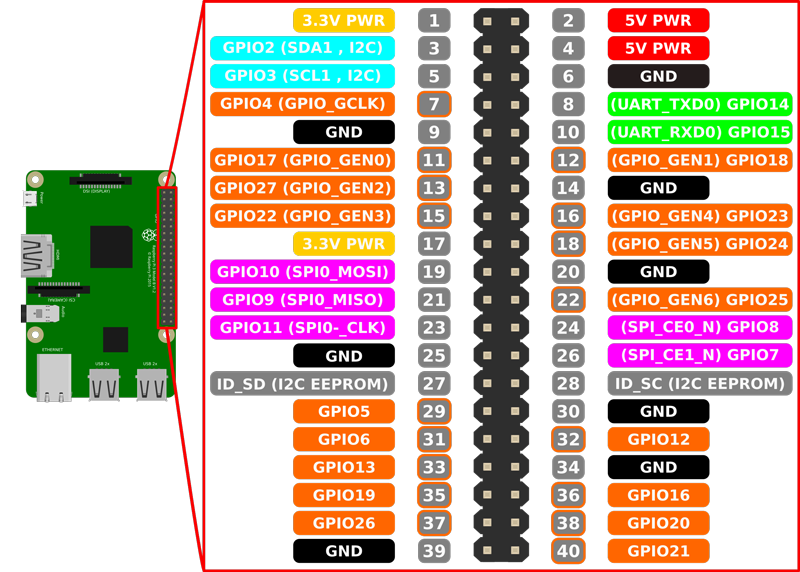

**Light'It Up Server documentation [www.b-stud.com](http://www.b-stud.com/projects/lightitup-server)**.


[1. Introduction](#1-introduction)<br/>
[2. Prerequisites](#2-prerequisites)<br/>
[3. Wiring](#3-wiring)<br/>
[4. Installation](#4-installation)<br/>
[5. Usage](#5-usage)<br/>
[5.1 Launching the server](#51-launching-the-server)<br/>
[5.2 Access to the interface](#52-access-to-the-interface)<br/>
[6 Features](#6-features)<br/>
[6.1 Adding light effects to your list](#61-adding-light-effects-to-your-list)<br/>
[6.2 Priorities](#62-priorities)<br/>
[6.3 Automatizing effects with the time scheduler](#63-automatizing-effects-with-the-time-scheduler)<br/>
[7. API](#7-api)<br/>
[8. License](#8-license)<br/>
[9. Author](#9-author)<br/>


## 1. Introduction

Light'It up server is a node server for Raspberry devices that let you easily animate your light strip. It integrates
the [Light'It Up engine](https://github.com/b-stud/lightitup-engine) to use existing or create customized light effects.
It uses HTTP requests and expose a very simple API, which means you can now easily integrate your lightstrip inside any domotics solution.
As described below, the server will offer you great features like a time scheduler, effects priorities management and more.

## 2. Prerequisites

**What do I need to make it work?**

- A Raspberry Device with any Debian based distribution (we recommend [DietPi](http://dietpi.com/), a light and efficient RPi OS)

  **Note 1**: Once you have installed the OS of your choice, you must **enabling SPI** communication, to do so :

   - Enter inside the configuration menu:  `sudo raspi-config`
   - Then select `Advanced options`  choose `SPI` enable it, save and reboot your device.

  **Note 2**: Tests have been mostly focused on RPi 3 and Zero W devices but it should work with any  RPi board.

- A compatible light strip powered by an adequate power supply

   For now, here is the light strips compatibility list, to be extended by the time.
   - APA102 (DotStar)
   - LPD8806
   - P8913
   - WS281X (WS2811, WS2811 400Khz, WS2812, WS2813, WS2818)
   - WS2801

   **Power supply**

   Depending on your light strip you will have to choose a 5V or 12V power supply, your choice will also depend on the length
   of the strip (big lengths require obviously more power, see your light strip datasheet to know what power by meter it consumes)

   - **Useful note :** If you have a 5V powered light strip, then you can safely use use the same power supply to power up your Raspberry device, to do so
   you will just have to cut an USB cable and to connect V+ and V- wires to your power supply.

   Choose any power supply compatible with your setup, for information purpose, we're using [this one](https://www.aliexpress.com/item/New-5V-2A-3A-4A-5A-6A-8A-10A-12A-20A-30A-40A-60A-SwitchLED-Power/32641542774.html).


- Optional but definitely recommended

    **If you want to handle audio effects**, as you probably already know, your Raspberry only have an audio output, which means
    you can only play audio effects on what is played by the RPi itself, which is not so funny.

    For 2$ and less, you can buy an USB audio card to plug any audio source you want.
    Choose any device you wish, for information, we're making the tests with [this one](https://www.aliexpress.com/item/New-usb-Sound-Card-7-1-Adapter-5HV2-3D-Audio-Headset-Microphone-3-5mm-For-Laptop/32816009052.html?spm=a2g0s.9042311.0.0.AmxeCs)
    You can even choose devices cheaper than 1$.

    You will also need a ~1$ audio signal splitter to get sound on your speakers at the same time.
    This one, [for example](https://www.aliexpress.com/item/1Pcs-New-Arrival-3-5mm-Headphone-Microphone-Stereo-Audio-Splitter-Adapter-Cable/32583511195.html).


## 3. Wiring

After having powered your light strip you will have to connect it to your Raspberry device, for this you will have to connect
the CLK and SI wires respectively to the SPI0_CLK (**PIN 19**), SPI0_MOSI  (**PIN 23**) pins of the RPi device.

If you're no using the same power supply for both the RPi and the lightstrip, you will also need to connect both the RPi and the
light strip grounds together (**Any GND PIN** of the RPi).




## 4. Installation

- Get the project source code either by `git clone` this repository or by downloading the archive and extracting it to your device.
- Move into the cloned or extracted folder `cd path/to/lightitup-server`
- **Set your configuration by editing the `default-config.yml` file**

    You will **at least** change LEDS_DRIVER, and LEDS_COUNT

    Note: You will also be able to change this file (will be moved at /opt/lightitup/) at any time after the installation process
- We are now ready to launch the installation by executing `sh install-script.sh` (It can take a while)
  - Note 1: We strongly advise you to make a backup of your SD card to prevent any possible issue before doing this.
  - Note 2: If for any reason you don't want the server to be installed as an autostarting service, edit the install-script.sh and change
  `autostart_service` to false. Then you will have to manually start the server at each boot.
- Once done, read the next section to learn what to do now.

## 5. Usage
### 5.1 Launching the server

- If you have left by default the install-script.sh:

  **You have nothing to do**, the server has started and will start by itself on
    each boot, a service has also been created, you can use it to (re)start & stop the server if needed).

    `service lightitup start (or restart or stop)`


- If you have decided to manually handling the server startup:

    Then you will have to run this command :

    `node /opt/lightitup/dist/index.js`

    You can append the following options to override the default configuration
    ```
    --port HTTP Port of the server
    --unsecured Will enforce not creating an HTTPS server
    --secured Will enforce to only create a HTTPS server
    --secured-port HTTPS Port of the server
    --no-audio To not handling the audio signal
    --device The audio device interface index
    --latency Audio device latency (ms) (e.g. in case of wireless speakers)
    ```

    Note: For a permanent configuration, you should edit the `default-config.yml` file instead

### 5.2 Access to the interface

You are now able to access to interface by browsing to :

`http://<RPi Device IP>:8000` (or any HTTP port you set in the config file)
`https://<RPi Device IP>:8443` (or any HTTPS port you set in the config file)

You should now see the Light'It Up server interface.
Some basics built-in effects are available by default, in the next section you will learn how to add other effects.

You can try to click on an effect to apply it on the lightstrip.

**Note**: If colors are inverted then you just have to change SPI.RGB_ORDER parameter in the `default-config.yml` file and then
restarting the server : `service lightitup restart`

### 6 Features

#### 6.1 Adding light effects to your list

To create effects or used existing presets, do the following process :

- Go to [http://www.b-stud.com/lightitup-configurator](http://www.b-stud.com/lightitup-configurator)
- Create and custom your effect using available options
- Then click on `Export current effect` and click on `Copy`
- Go back to the server interface and click on `New Effect`
- Give a unique name to your effect, for example: My custom Green Pulse
- On the config field, paste the effect you have copied from the configurator
- You can also set the optional `Default limit time` if you want the effect to stop running after a certain time
- You can change the `Default priority` to give more or less importance to the effect (see explanations below)
- Then click save, you are now able to use this effect.

#### 6.2 Priorities

Let's imagine you have created a sunrise effect that lasts 30 minutes to gently wake up you. Now let's imagine that
you use the HTTP API with a domotic solution  (Jeedom, Domoticz..) and you have set up another effect, Red Alert that is set to the lightstrip when
someone opens the entry door. The red alert is of course much more important than the sunrise, so it has to interrupt the sunrise effect.

Then, when the red alert is finished (let say after 10 seconds), the sunrise is able to resume as if it had not been interrupted at all.
That is all the sense of effects priorities. For this scenario we should for example have set the sunrise priority to `0` and the red alert
priority to `1` or anything higher than 0.

#### 6.3 Automatizing effects with the time scheduler

The time scheduler gives a way to repeat launching effects over the time, for example, you could set sunset each day at 7pm,
you could then schedule a Static Blue at 10pm from Monday to Friday, and so on..

To use the scheduler, you just to have to click the "Scheduler" button on the interface.
Then you can very simply setup all you want to.


## 7. API

To control your light strip from outside, from a Domotics solution or from any other software able to send HTTP requests,
a simple API is available.

### Check if the server is online

- **URL** /ping
- **Method** GET
- **Return** 200, `online`

### Reset the lightstrip

- **URL** /reset
- **Method** POST
- **Return** 200, `Reset done`

### Setup an effect on the fly (not saved in your list)

- **URL** /stack
- **Header** Content-Type: application/json
- **Method** POST
- **Body**

```javascript
{
    "config":    [
                   {
                     "name": "simple-color",
                     "options": {
                       "activated": true,
                       "delay": 0,
                       "duration": 3000,
                       "waitAtEnd": 0,
                       "repeat": null,
                       "color": [
                         0,
                         80,
                         250
                       ]
                     }
                   }
                 ],            // Array of effects bricks as exported from the configurator
    "timeLimit": integer|null,  // <optional>   //If not null, effect will be stopped after this milliseconds time value
    "priority":  integer|null   // <optional> , //If not null, the effect will be positioned in the stack depending on its priority, the greatest priority wins
                                // Note: The effect that "losts" is not removed, it will resume after the new one is finished (if the new one it's a finite time effect).
}
```

- **Return** 200, `sent` or 200, `error`


### Getting the list of your registered effects

- **URL** /manager
- **Method** GET
- **Return** 200, JSON array of the effects list

### Registering (saving) a new effect on your list

- **URL** /manager
- **Method** POST
- **Header** Content-Type: application/json
- **Body**

```javascript
{
    "name":"My New Effect",
    "config": [], // Array of effects bricks as exported from the configurator
    "timeLimit":"", // Leave to null for a forever running effect, set a millisecond value else
    "priority":"0" // Any integer value (see above for explanations on priorities)
}
```
- **Return** 200, `done` OR 400, `An error occurred`


### Updating an effect registered on the list

- **URL** /manager/`effect-id`
- **Method** PUT
- **Header** Content-Type: application/json
- **Body**

```javascript
{
    "name":"My New Effect",
    "config": [], // Array of effects bricks as exported from the configurator
    "timeLimit":"", // Leave to null for a forever running effect, set a millisecond value else
    "priority":"0" // Any integer value (see above for explanations on priorities)
}
```
- **Return** 200, `done` OR 400, `An error occurred`


### Deleting an effect registered on the list

- **URL** /manager/`effect-id`
- **Method** DELETE
- **Return** 200, `done` OR 400, `Could not delete the effect`

### Applying an effect on the light strip

- **URL** /manager/apply/`effect-name`
- **Optional URL parameters** `priority` (integer value), `timeLimit` (millisecond time value). These parameters will override the effect settings.
- **Method** POST


## 8. License
Please find all the license information inside the LICENSE.md file

## 9. Author
Bilel OURAL - bilel.oural@b-stud.com
